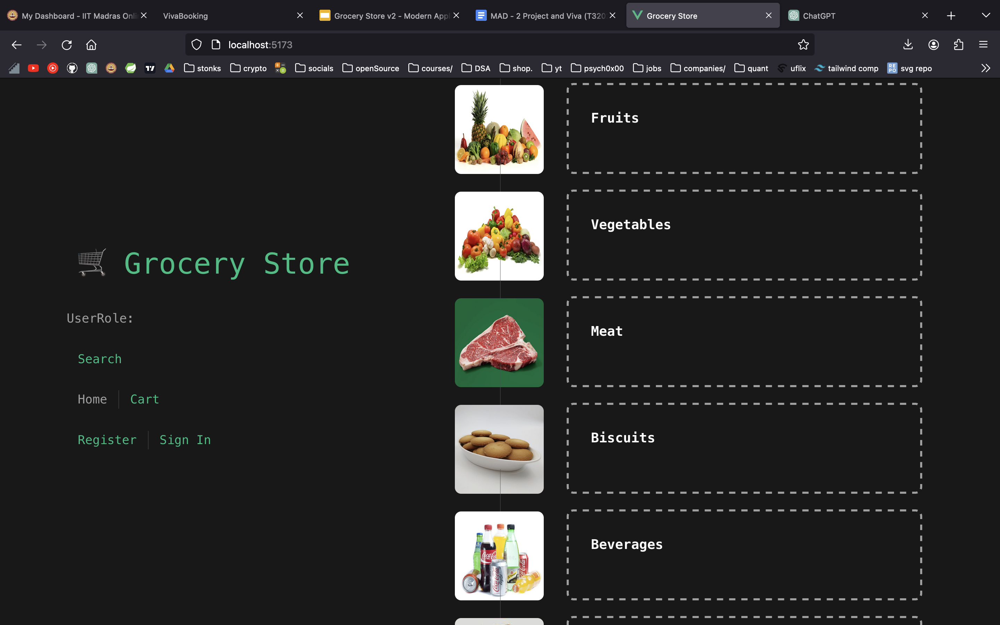
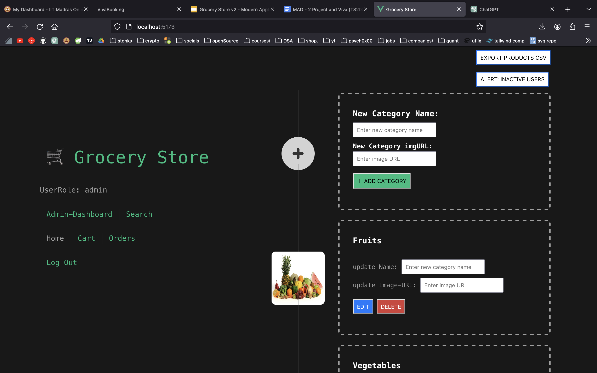
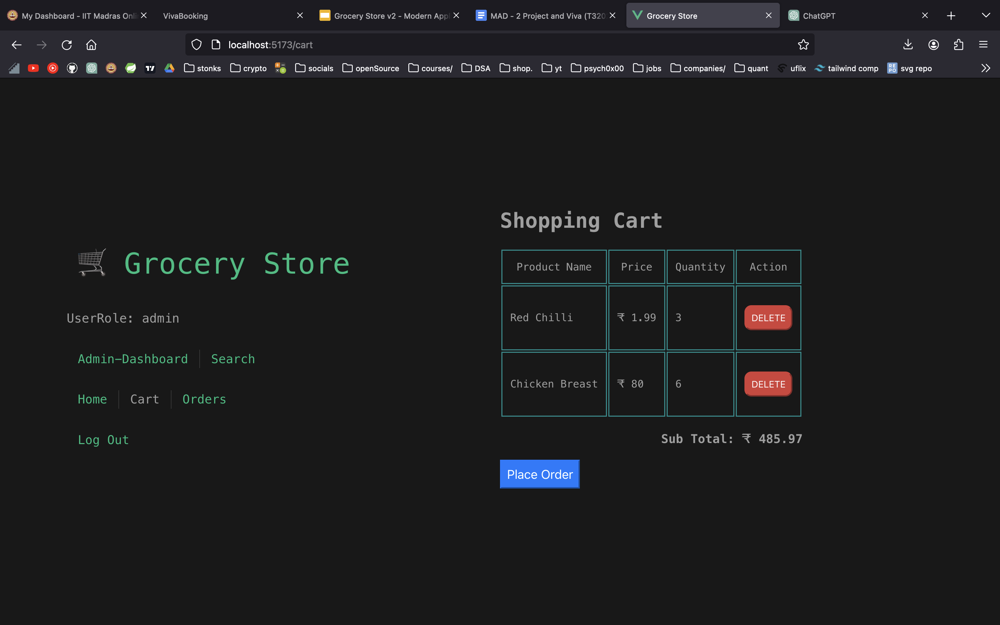
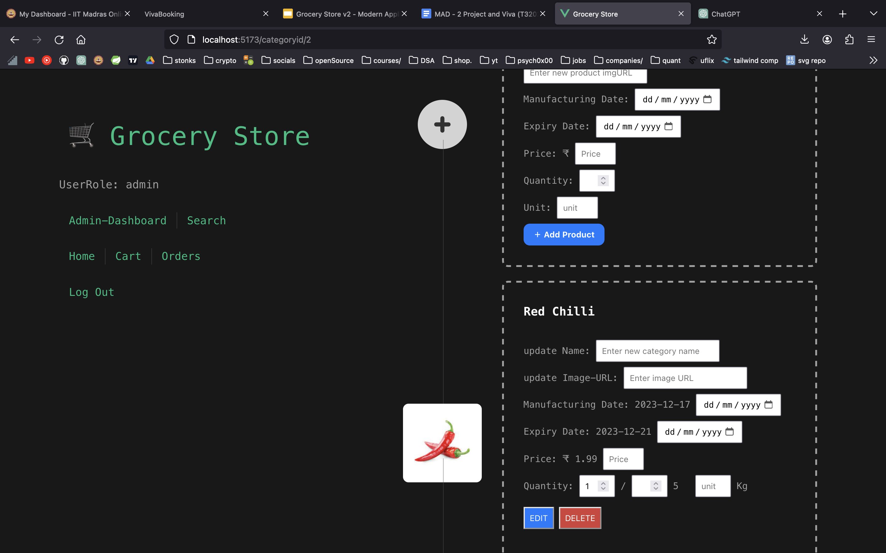
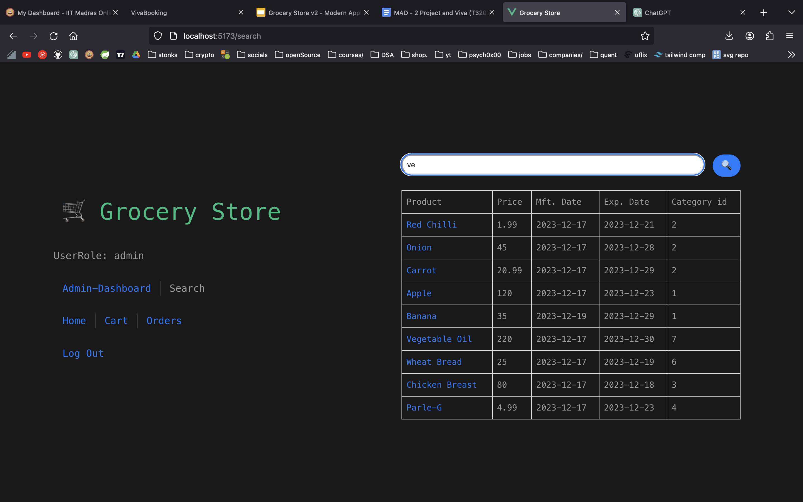

# Fullstack-Flask-Vue-Redis-Celery-Project

## How to Run

- Clone the repository.
  
  ```shell
  git clone https://github.com/anurag-sachan/Flask-Vue-Redis-Celery-FullstackStore.git
  ```

- Spin the docker container for redis-instance and update the backend configurations [**here**](app.py).
  
    > If you are unsure about the redis setup, you can always use docker. It's extremely simple. <br/>
    > Go to base folder. Run the command below :

    > This will create a redis container named `my-redis-container`

    ```shell
    docker run --rm --name my-redis-container -p 6379:6379 -d redis
    ```

    > To check if the instance is running properly
    > redis-cli ping
    > redis-cli -d 0
    > keys *

- Setup the Celery workers ( for tasks ) & beat ( for schedule jobs )
  ```shell
  celery -A app.celery_app worker --loglevel=info
  ```

  ```shell
  celery -A app.celery_app beat --loglevel=info
  ```
    
- Run the Backend:
  > If database.db is not present

  ```shell
  python3 DB.py
  ```
  ```shell
  python3 app.py
  ```
  
  > If database.db is already present
  ```shell
  python3 app.py
  ```

- Run the frontend:

  cd frontend/

  ```shell
  # to install required node_module files

  npm install
  ```

  ```shell
  npm run dev
  ```

## Screenshots
- Please refer to the working demo-images from [**here**](demo-jpg).
  
User                  |  Admin
:-------------------------:|:-------------------------:
  |  
  |  
  |  
  |  

<br/>
